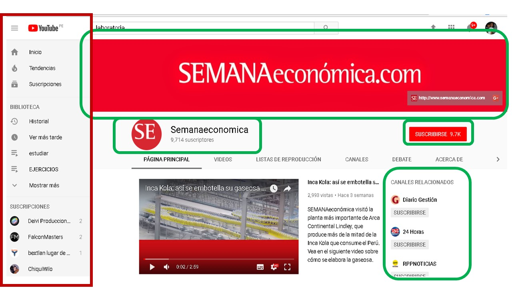

# PARTES DE LA WEB
_____________

## YOUTUBE

### UX (AREAS EN VERDE)

a.Botón con el logo de la aplicación, para regresar al inicio.
b.Videos recomendados en el inicio según el historial del usuario.
c.Lista de canales suscritos
d.Busqueda con autocompletado.
e.Botones PAUSA, PLAY, SIGUIENTE VIDEO Y AUDIO se visualicen en el video
f.Opcion reporduccion automatica
g.Menu contextual con lista e sugerencias
h.Boton Like 
i.Botones de configuracion y subtitulos
j.Foto del perfil del usuario.
k.Poner una imagen de perfil del usuario.

### UI (AREAS EN ROJO)
a.Orden y perfil del usuario
b.Dropdown del canal
c.Diseño de los botones del menú.
d.Resaltado de la pagina actual
e.Uso de colores: rojo y gris
f.Diseño de los menus de navegación
g.La forma, tamaño y colores de los cuadros de videos.
h.Uso de los colores de la marca en la barra de visualización del video.
i.Orden de  videos relacionados.

## Detalles adicionales

  
  Cualquier consulta, duda o sugerencia puede realizarla al correo: adayc@hotmail.com
