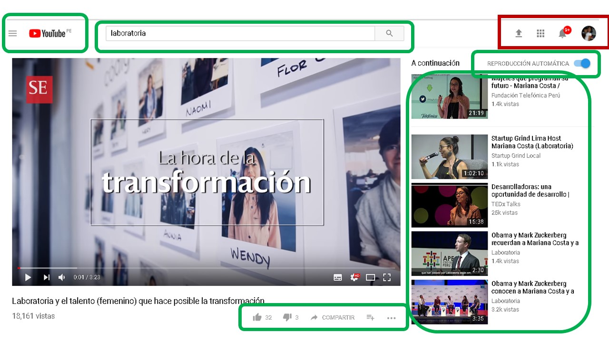

# PARTES DE LA WEB
_____________

## YOUTUBE

### UX (AREAS EN VERDE)

Botón con el logo de la aplicación, para regresar al inicio.
Videos recomendados en el inicio según el historial del usuario.
Lista de canales suscritos
Busqueda con autocompletado.
Botones PAUSA, PLAY, SIGUIENTE VIDEO Y AUDIO se visualicen en el video
Opcion reporduccion automatica
Menu contextual con lista e sugerencias
Boton Like 
Botones de configuracion y subtitulos
Foto del perfil del usuario.
Poner una imagen de perfil del usuario.

### UI (AREAS EN ROJO)
Orden y perfil del usuario
Dropdown del canal
Diseño de los botones del menú.
Resaltado de la pagina actual
Uso de colores: rojo y gris
Diseño de los menus de navegación

La forma, tamaño y colores de los cuadros de videos.
Uso de los colores de la marca en la barra de visualización del video.
Orden de  videos relacionados.

## Detalles adicionales

  
  Cualquier consulta, duda o sugerencia puede realizarla al correo: adayc@hotmail.com
